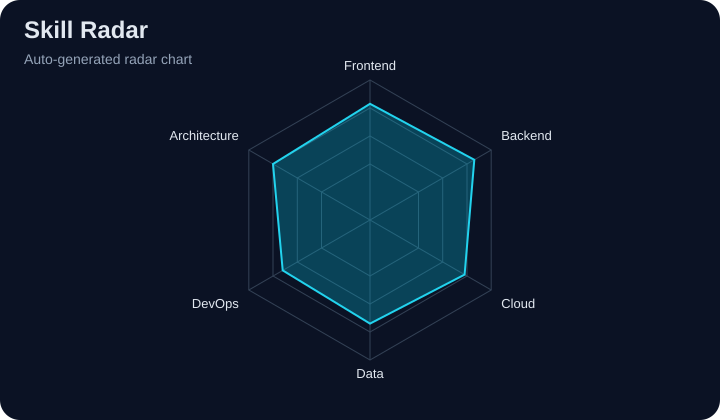
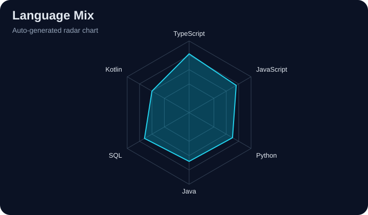



<picture>
   <source media="(prefers-color-scheme: dark)" srcset="assets/banner-dark.v12.svg">
   <source media="(prefers-color-scheme: light)" srcset="assets/banner-light.v12.svg">
   
</picture>

 

 

&nbsp;&nbsp;

&nbsp;&nbsp;

 

---

## This is me :)

I am Johandry, a Full Stack Developer focused on building robust software that works in real-world production.

- I build end-to-end solutions across frontend, backend, cloud, and data.
- I prioritize clean architecture, readability, and maintainability.
- I like delivering features fast without compromising reliability.
- I am always learning and improving through real project execution.

---

## my perfect stack

---

## signals

<table>
<tr>
<td width="50%" align="center" valign="middle">
<picture>
   <source media="(prefers-color-scheme: dark)" srcset="assets/radar-dark.svg">
   <source media="(prefers-color-scheme: light)" srcset="assets/radar-light.svg">
   
</picture>
</td>
<td width="50%" align="center" valign="middle">
<picture>
   <source media="(prefers-color-scheme: dark)" srcset="assets/radar-langs-dark.svg">
   <source media="(prefers-color-scheme: light)" srcset="assets/radar-langs-light.svg">
   
</picture>
</td>
</tr>
</table>

---

## databases and tools

---

## Numbers matter? ohhh yes.

 

---

   Built by Johandry Viles | Keep building, keep learning.

